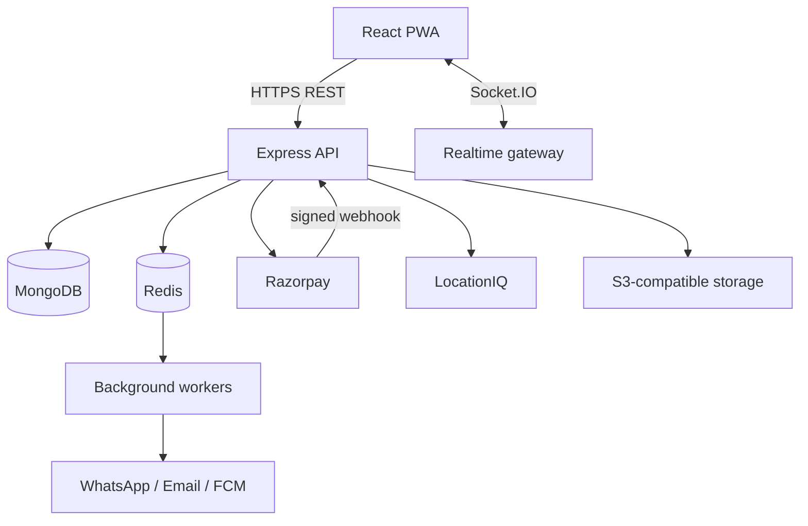

# GETFIT4U Architecture

## Scope

GETFIT4U is a multi-tenant fitness platform for public gym discovery, member subscriptions, gym operations, trainers, platform administration, attendance, payments and communications. The same API serves the responsive web/PWA client. Tenant isolation is enforced by `gymId` in the API, never only in the UI.

## Technology

- Frontend: React 19, TypeScript, Vite, React Router, TanStack Query, React Hook Form, Zod and vanilla CSS.
- Backend: Node.js, Express 5, TypeScript, MongoDB/Mongoose, Socket.IO, BullMQ/Redis and Pino.
- Providers: Razorpay, LocationIQ, Firebase Cloud Messaging, WhatsApp Cloud API and S3-compatible object storage.
- Testing: Vitest/Supertest and Playwright.

## Runtime topology

## Modules

1. Identity: login, registration, OTP, Google OAuth, password reset, refresh rotation and device sessions.
2. Tenancy/RBAC: role and permission checks plus gym-scoped authorization.
3. Discovery: active/verified gyms, geospatial search, filters, favorites, reviews and directions.
4. Gym onboarding: saved profile, admin-configured registration plan, backend-verified payment capture and automatic activation.
5. Membership commerce: plans, quotes, coupons, subscription lifecycle, invoices, payments, refunds and settlements.
6. Attendance: signed short-lived QR, gym scanner, optional geofence, immutable events and projections.
7. Operations: members, trainers, workout plans, progress, classes, bookings, offers and ads.
8. Engagement: persistent conversations/messages, notifications, campaigns and WhatsApp.
9. Platform operations: dashboards, payment monitoring, gym moderation, audit logs, support and configuration.

## Conventions

- API prefix `/api/v1`; JSON success/error envelopes; request ID returned in `x-request-id`.
- Money is stored in minor units (`priceMinor`) and ISO currency; never floating-point rupees.
- Dates are UTC ISO-8601; gym opening hours use the gym IANA timezone.
- Coordinates are GeoJSON `[longitude, latitude]` with `2dsphere` indexes.
- Mutating payment and attendance endpoints accept `Idempotency-Key`. Payment capture also uses gateway event IDs and transactional state checks to deduplicate activation.
- Soft deletion uses `deletedAt`; legal/audit/payment records are retained, not cascaded.
- Provider callbacks enter through verified webhooks and inbox-deduplication records.

## Deployment

Frontend and API are separate deployable units. Production uses TLS, a managed MongoDB replica set (transactions), Redis, private object storage, restrictive CORS and secret injection. Horizontal API replicas share Socket.IO presence through Redis. Workers process scheduled expiry reminders, campaigns, webhook retries, reconciliation and analytics projections.
