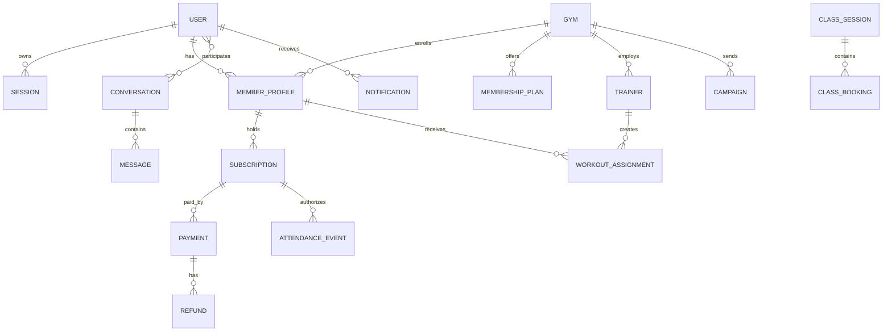

# Database Schema

## Relationship overview



## Collections

| Collection | Purpose and important fields | Indexes / relations / deletion |
|---|---|---|
| `users` | Identity: publicId, name, email/phone, passwordHash, roles, status, profile, preferences, verifiedAt, deletedAt | Unique sparse normalized email/phone; status index. Referenced everywhere; soft delete/anonymize |
| `authsessions` | Revocable device refresh sessions: userId, tokenHash, device, IP hash, expiry/revocation | user+expiry, unique token hash, TTL expiry; many per User |
| `otprequests` | Hashed OTP/reset challenges, purpose, target hash, attempts, expiry | TTL; never stores plain OTP |
| `gyms` | Owner, identity, contact, hours, facilities, media, verification/public status, GeoJSON location | slug unique, location 2dsphere, text/search and status indexes; one owner can have many gyms |
| `gymregistrations` | Onboarding workflow, documents, checklist, platform plan/payment and rejection history | owner/status/created indexes; retained for audit |
| `memberprofiles` | User’s gym-specific member code, measurements, goals, emergency contact, notes/current subscription | unique gym+memberCode and gym+user; one user may belong to many gyms |
| `trainers` | User/gym, qualifications, specializations, schedule and status | gym+status, unique gym+user; archive rather than delete |
| `membershipplans` | Versioned gym plan, duration, price, tax, benefits/access/freeze/trial rules | unique gym+code+version; historical versions retained |
| `planquotes` | Immutable purchaser/gym/plan snapshot and computed totals with expiry | publicId unique, TTL expiry |
| `subscriptions` | Member/platform lifecycle, immutable plan snapshot, dates, renewal, freeze/cancel state | user/gym/status/end-date indexes; never hard-delete financial history |
| `subscriptionevents` | Append-only lifecycle facts | subscription+occurredAt |
| `payments` | Provider identifiers, purpose, amount/currency, status, method/failure/reconciliation | unique sparse provider IDs; payer/gym/date/status |
| `refunds` | Payment, amount, provider refund ID, reason/status, actor | payment+createdAt; total refunds cannot exceed captured amount |
| `invoices` | GST-ready number, supplier/customer snapshots, lines, tax totals and PDF key | unique number, subscription/payment relations; immutable after issue, corrected by credit note |
| `attendanceevents` | Immutable check-in/check-out fact with member, subscription, source, time, scanner and location evidence | gym+time, member+time, unique dedupe key |
| `attendanceprojections` | Rebuildable streak/monthly counters | unique gym+member |
| `classsessions` | Gym/trainer schedule, capacity, start/end, status | gym+start, trainer+start |
| `classbookings` | Member booking/waitlist/attendance | unique session+member; session has many bookings |
| `workoutplans` | Trainer/gym versioned exercise prescription | gym+trainer+status |
| `workoutassignments` | Plan snapshot assigned to member, start/end/status | member+status/date; many-to-many bridge |
| `progressentries` | Member measurement/goal/photo entries recorded by member/trainer | member+recordedAt |
| `conversations` | Participant IDs, gym scope, last message and type | participants multikey, updatedAt; never returned to nonparticipants |
| `messages` | Conversation, sender, clientMessageId, body/type/attachments, delivered/read arrays | conversation+createdAt cursor; unique sender+clientMessageId |
| `notifications` | Recipient, category, title/body, safe navigation entity/path, read/delivery state | user+readAt+createdAt; recipient can delete own history softly |
| `devicetokens` | User/browser FCM token, platform, lastSeen/revoked | unique token; remove/revoke on logout |
| `favorites` | User-gym bridge | unique user+gym; hard delete safe |
| `reviews` | User/gym rating, photos, moderation, owner response | unique user+gym, gym+status/date; moderation retains record |
| `campaigns` | Owner/admin audience snapshot, channel, template, schedule and analytics | gym+status+schedule |
| `offers`, `advertisements`, `coupons` | Validity, targeting, budget/redemptions and active state | gym/status/dates; retain referenced promotion snapshots |
| `supporttickets` | Requester/gym, severity, SLA, status and message history | requester/status/updated and queue indexes |
| `bankaccounts` | Owner/gym account holder, encrypted/tokenized provider reference, masked number, IFSC, verification | never store full displayable account number unencrypted |
| `settlements` | Gym payout period, gross/commission/refunds/net/provider status | gym+period/status |
| `auditlogs` | Actor, action, entity, before/after, outcome, request/device/IP hash | actor/gym/entity+time; append-only |
| `providerevents` | Webhook inbox/deduplication | unique provider+eventKey |
| `outboxevents` | Retryable internal integration events | status+availableAt |
| `idempotencyrecords` | Mutation replay protection | unique scope+key, TTL |

## Plain-language relationships

One User can own multiple device Sessions and can have one MemberProfile per Gym. Therefore `MemberProfile` stores both `userId` and `gymId`; the compound unique index prevents duplicate membership identities.

One Gym offers many versioned MembershipPlans. A Subscription stores a plan snapshot rather than depending on a mutable plan. One Subscription can have several Payment attempts and Refunds; the successful Payment points back to the Subscription.

One Trainer belongs to a Gym and can create many WorkoutPlans. `WorkoutAssignment` connects a plan/version to a MemberProfile, creating a controlled many-to-many relationship while preserving the assigned snapshot.

A ClassSession has many ClassBookings, while each MemberProfile may book many sessions. The compound unique index prevents duplicate booking.

A Conversation contains several participant User IDs and many Messages. Every Message belongs to exactly one Conversation and one sender. API authorization requires the current user in `participants`.

A User receives many Notifications and can register several DeviceTokens. Notification navigation stores an allowlisted entity type/id; clients do not trust arbitrary external URLs.

## Example documents

```json
{"_id":"...","publicId":"gym_ironpulse","ownerId":"...","name":"Iron Pulse Fitness","slug":"iron-pulse-fitness","status":"ACTIVE","verificationStatus":"VERIFIED","location":{"type":"Point","coordinates":[78.4867,17.3850]},"timezone":"Asia/Kolkata"}
```

```json
{"publicId":"sub_123","type":"GYM_MEMBERSHIP","userId":"...","gymId":"...","memberProfileId":"...","planSnapshot":{"name":"Quarterly","durationDays":90,"priceMinor":599900},"status":"ACTIVE","startsAt":"2026-09-01T00:00:00.000Z","endsAt":"2026-11-30T00:00:00.000Z"}
```

```json
{"conversationId":"...","senderId":"...","clientMessageId":"web-uuid","type":"TEXT","text":"Can we move tomorrow's session?","deliveredTo":["..."],"readBy":["..."],"createdAt":"2026-09-06T12:00:00.000Z"}
```

